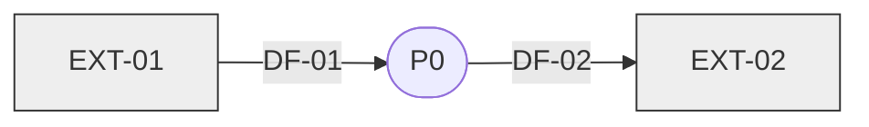
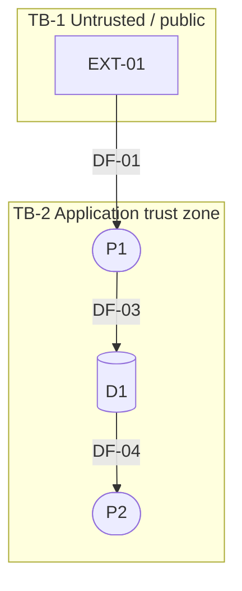
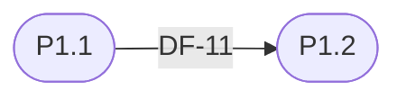

# /agentic-harness:dfd

Fourth planning stage, mandatory. Turns the SRS's requirements into a
logical picture of how data actually moves through the system: processes,
external entities, data stores, flows, and trust boundaries. This is the
system-architecture artifact the harness was missing — every other stage
either states requirements (SRS) or records point decisions (ADR); this
one shows how the pieces fit together, which `/agentic-harness:features`'
**Proposed owning area** field and `/agentic-harness:adr`'s decision
inventory both need and don't otherwise have. Follows
`${CLAUDE_PLUGIN_ROOT}/docs/planning-protocol.md`, including its Diagram
conventions section.

## Gate

`planning.stages.srs.status` must be `approved`. `design` must be
`approved` or `skipped` (not left `pending`/`draft`) — if it's genuinely
undecided, ask the user to resolve `/agentic-harness:design` first. (This
check used to live in `features.md`; it lives here now because this is
the stage immediately after design.)

## Inputs

`planning/SRS.md` — §2.4 Operating Environment, §3 System Features
(primary flows), §4 Data Requirements, §5 External Interface Requirements.
`planning/DESIGN.md` if it exists (a screen inventory implies user-facing
flows worth tracing). If `planning.entry_point == existing-project`, also
dispatch `agentic-harness:codebase-analyst` for module boundaries and its
**External integrations** section — real third-party APIs/queues/DBs are
external-entity candidates, not something an idea-stage DFD should invent.

## Question ladder

Continue `planning-protocol.md`'s ladder, worked **one level-1 process at
a time** (same reasoning as `srs.md`'s per-module ladder — keeps each
`AskUserQuestion` batch coherent):

- **System boundary** — what's genuinely external (third-party systems,
  other internal systems this project doesn't own, human actors) vs.
  in-scope. Get this wrong and every downstream diagram is wrong.
- **Process decomposition** — which SRS modules/features are naturally one
  process vs. several; what each process's single responsibility is.
- **System of record** — for each entity in SRS §4.1, which process writes
  the authoritative copy, and which processes only read/cache it.
- **Sync vs async** — per flow, does the caller wait for a result, or is
  it fire-and-forget/event-driven? This is later evidence for a queueing
  ADR — don't let "the system shall notify the user" hide a real async
  decision.
- **Trust boundaries** — where does data cross from less-trusted to
  more-trusted (public internet → app, app → third-party, tenant →
  tenant)? Each crossing needs a named control (auth, mTLS, signature) —
  see NFR-SECURITY refs in SRS §6.
- **Failure modes** — what happens when a flow fails: retry, dead-letter,
  user-visible error. Never "it just fails" without the user choosing that.

## Two rules that keep this artifact honest

- **Process names are verb phrases** ("Validate submission," "Enrich
  order"), never nouns ("Validation service," "Order enricher"). A noun
  names a *component* — naming components here is exactly how a DFD drifts
  into an accidental, premature deployment diagram.
- **Out of scope, always:** no servers, containers, regions, instance
  counts, or scaling policy. This document is logical, not physical — a
  deployment picture belongs in whichever ADR decides the deployment
  target (see §8 below), not here. There is no second, later pass that
  adds a physical view (see planning-protocol.md's Diagram conventions);
  if the logical picture changes after ADRs are written, that's a normal
  versioned revision like any other artifact.

## Level-2 decomposition — only where warranted

Decompose a level-1 process to level 2 only if **at least one** holds: it
implements 4 or more distinct FRs; it touches 2 or more data stores; or a
trust boundary runs through it. Otherwise stop at level 1 and record *why*
in the "not warranted" table (§4.2 below) — a reader shouldn't have to
guess whether a process was overlooked or deliberately left flat.

## Output — `planning/DFD.md`

Follow `planning-protocol.md`'s Document format and this file's own
Diagram conventions (mermaid only, never an image; shapes and IDs below).

```markdown
# Data Flow Architecture

## <Project Name>

| | |
|---|---|
| **Document title** | <Project Name> — Data Flow Architecture |
| **Version** | 0.1 (Draft) |
| **Date** | <today> |
| **Author** | <user/org> |
| **Based on** | SRS v<x><, DESIGN v<y> if it exists> |
| **Status** | For review |

---

## 1. Introduction
### 1.1 Purpose
This document is the logical decomposition of the system into processes,
the data that moves between them, and where that data rests. It is
**logical, not physical** — no servers, containers, regions, or instance
counts. Deployment shape is decided in an ADR (§8), not here.
### 1.2 System boundary
One paragraph: what's inside the system this project builds, and what's
outside it. Everything outside becomes an external entity in §2.
### 1.3 Notation and conventions
| Element | Shape | ID | Mermaid |
|---|---|---|---|
| Process | stadium (rounded) | `P1`, `P2.1` | `P1(["P1 Verb the noun"])` |
| Data store | cylinder | `D1` | `D1[("D1 Orders")]` |
| External entity | rectangle | `EXT-01` | `EXT01["EXT-01 Payment provider"]` |
| Data flow | labelled directed edge | `DF-01` | `P1 -->|"DF-01 order payload"| D1` |
| Async/queued flow | dashed edge | `DF-07` | `P1 -.->|"DF-07 receipt event"| P3` |
| Trust boundary | dashed subgraph | `TB-1` | `subgraph TB1["TB-1 Public internet"]` |

Process names are verb phrases, never nouns (see above). Mermaid node IDs
never contain a dot — `P2_1(["P2.1 Validate payment"])`, underscore in the
ID, dotted number in the label.

## 2. Context diagram (level 0)



### 2.1 External entities
| ID | External entity | Kind | Traces to | Flows |
|---|---|---|---|---|
| EXT-01 | <name> | user class / third-party API / upstream system / scheduler | SRS §2.3 or §5.2/§5.3 | DF-01, DF-04 |

*Every row cites an SRS §2.3 user class or an SRS §5 interface — an
external entity with no upstream trace is fabricated (see §9).*

## 3. Level-1 decomposition



### 3.1 Process inventory
| ID | Process (verb phrase) | Responsibility (1 line) | Implements | Reads | Writes | Level-2? |
|---|---|---|---|---|---|---|
| P1 | <verb phrase> | ... | FR-<MOD>-01..04 | D2 | D1 | yes → §4.1 |

*The `Implements` column is the FR-coverage spine — §9 check 2 reads it.
`Process → owning area`: `/agentic-harness:features` uses this table's
IDs as each feature's Proposed owning area, and `/agentic-harness:configure`
Step 5 seeds `architecture.segments` from it.*

## 4. Level-2 decomposition

Decompose only per the rule above (4+ FRs, 2+ stores, or a trust boundary
running through the process). Every level-2 diagram must balance against
its parent (§9 check 1).

### 4.1 P1 — <verb phrase>

| ID | Sub-process | Implements | Parent flow in | Parent flow out |
|---|---|---|---|---|
| P1.1 | ... | FR-<MOD>-01 | DF-01 | — |

### 4.2 Not warranted
| Process | Why level-1 is enough |
|---|---|
| P3 | 2 FRs, 1 store, no trust boundary through it |

## 5. Data stores
| ID | Store | Holds (SRS §4.1 entities) | Written by | Read by | Durability | Trust zone |
|---|---|---|---|---|---|---|
| D1 | Orders | Order, OrderLine | P1 | P2, P4 | durable / cache / transient | TB-2 |

*"Holds" cites SRS §4.1 entities by name, and — once `planning/ERD.md`
exists — the same entity names appear there too; §9 checks this both
ways. Declare any write-only (sink) or read-only (seeded externally)
store explicitly; §9 flags undeclared ones.*

## 6. Flow inventory
| ID | From | To | Data carried | Sync/Async | Trigger | Crosses | Traces to |
|---|---|---|---|---|---|---|---|
| DF-01 | EXT-01 | P1 | submission payload | sync | user action | TB-1→TB-2 | FR-<MOD>-01 |
| DF-07 | P1 | P3 | receipt event | async | on commit | — | FR-<MOD>-05 |

*Flows carry **data**, never control ("approved," not "call P3"). The
`Crosses` column feeds §7; the Sync/Async column is evidence for a
queueing ADR (§8).*

## 7. Trust boundaries
| ID | Boundary | Separates | Crossing flows | Governed by | Control |
|---|---|---|---|---|---|
| TB-1 | Public internet ↔ application | EXT-01 ↔ P1 | DF-01, DF-02 | NFR-SECURITY-01 | mTLS + bearer token |

*Every crossing flow names the NFR that governs it. An uncited crossing is
reported in §9 — this is how the SRS's security NFRs land somewhere
structural instead of only in a table.*

## 8. Decisions this diagram provokes

Forward input to `/agentic-harness:adr`'s decision inventory — evidence,
not decisions. Nothing here is chosen in this document.

| Candidate decision | Evidence from this document |
|---|---|
| Async / queueing | DF-07, DF-09 are async and high-volume (§6) |
| Multi-tenancy model | D2 is shared across EXT-01 and EXT-03 (§5) |
| API style | EXT-01 needs a public read surface over 4 stores (§2, §5) |
| Deployment / hosting | TB-1/TB-2 split implies a network boundary (§7) |

## 9. Balance & orphan check
- Level balance (level-2 ↔ level-1 ↔ level-0): N/N flows reconciled; unbalanced: ...
- FRs with no process: ... (or "none")
- Processes citing no FR/NFR: ...
- Stores with no SRS §4.1 entity: ... / SRS §4.1 entities in no store: ...
- External entities with no SRS §2.3/§5 trace: ... / SRS §5 interfaces with no external entity: ...
- Black holes (input, no output): ... · Miracles (output, no input): ...
- Write-only / read-only stores not declared as such: ...
- Illegal flows (external→external, store→store): ...
- Boundary-crossing flows with no governing NFR: ...

## Assumptions & Constraints
## Open Items (TBD)
1. <unresolved item> (§<section>)

---
*End of document — Draft v0.1. Open items: <1-line summary, or "none">.*
```

## Balance & orphan check

Three families, all reported in §9 above and summarized in the report below:

- **Vertical (level balancing).** Every flow crossing a decomposed
  process's boundary at level N must appear as an in/out flow of its
  parent at level N−1 — same name, same direction. Report `N/N
  reconciled` plus any unbalanced flows. This is what makes multi-level
  decomposition trustworthy — without it, level-2 diagrams can silently
  contradict level-1.
- **Horizontal, bidirectional** (same shape as `features.md`'s orphan
  check): every SRS FR appears in ≥1 process's `Implements` column (an FR
  in no process means the system has nowhere to perform it — an SRS
  defect, reported, not absorbed); every process cites ≥1 FR/NFR (a
  process with none is invented mechanism or a missing requirement);
  every store's `Holds` names ≥1 SRS §4.1 entity, and every §4.1 entity
  lives in ≥1 store unless explicitly declared derived/transient; every
  external entity traces to an SRS §2.3 user class or a §5 interface, and
  every §5 interface appears as ≥1 external entity with ≥1 flow (this
  catches "we forgot the payment provider exists").
- **Mechanical validity.** Black holes (input, no output), miracles
  (output, no input), undeclared write-only/read-only stores, illegal
  flows (external→external, store→store — a process must mediate), and
  every boundary-crossing flow naming its governing NFR (an uncited
  crossing is how a security NFR quietly never gets enforced — the same
  argument `epics.md` makes against a separate "NFR epic").

## Approval gate

Per `planning-protocol.md` (Versioning applies — archive before rewrite).
On approval, set `planning.stages.dfd.status: approved` + `approved_on`.

## Report (≤7 lines)

```
planning/DFD.md: v<version> (<written/updated>, based on SRS v<x>)
Processes: N (level-2 decomposed: N) · Data stores: N · External entities: N
Level balance: N/N reconciled (or list unbalanced)
Orphans: FR->process N, process->FR N, store<->SRS-entity N, external-entity<->SRS N (or "none")
Open items: N
Status: draft/approved
Next: /agentic-harness:erd (if has_data_model) or /agentic-harness:features
```
