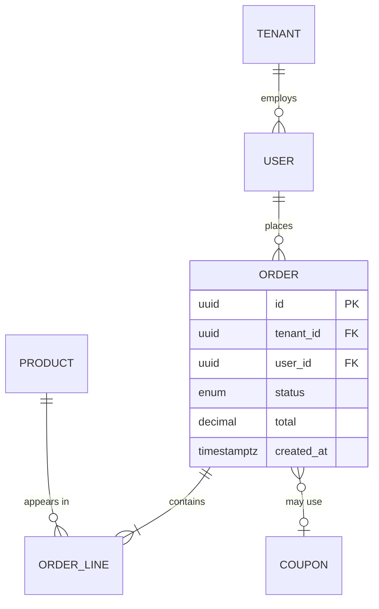

# /agentic-harness:erd

Fifth planning stage, and the second of two optional stages (the first is
`/agentic-harness:design`). Produces the logical data model this harness
was otherwise missing entirely — `SRS.md §4 Data Requirements` only ever
held a summary (Core Entities, Key Attributes, an Entity Relationships
overview, an optional state machine). This document is where a real
model lives: full attributes, keys, cardinality, normalization stance,
access patterns, and lifecycle. The entity-relationship diagram is one
section of it, not the whole document. Follows
`${CLAUDE_PLUGIN_ROOT}/docs/planning-protocol.md`, including its Diagram
conventions section.

## Gate

`planning.stages.dfd.status` must be `approved`.

## Skip check (do this first, every invocation)

If `planning.has_data_model == false`: **check the approved DFD first.**
If `planning/DFD.md` §5 Data Stores declares one or more stores, `false`
is a contradiction — durable structured state exists. Report the
conflict, name the stores, and ask the user to reconcile (either the flag
is wrong, or those stores are genuinely opaque/unstructured and DFD §5
should say so). Do not skip on contradictory state, and do not silently
flip the flag yourself.

Otherwise report `ERD stage: skipped (no structured data model)` and
stop — do not ask again this session.

If `planning.has_data_model == "later"` or unset: read `planning/SRS.md`
§4.1 Core Entities and `planning/DFD.md` §5 first — per
planning-protocol.md's Questioning section, inspect existing artifacts
before asking — and ask once with whatever that evidence recommends. If
still undecided, stay `pending` and stop.

## Inputs

`planning/SRS.md` §4 Data Requirements, §7 Other Requirements (retention).
`planning/DFD.md` §5 Data Stores (required — every store there needs an
entity home here or an explicit "opaque/unstructured" note). If
`planning.entry_point == existing-project`, dispatch
`agentic-harness:codebase-analyst` for its **Data model** section (schema
files, migrations, ORM models — real evidence, not invention).

## Altitude rule

Per `planning-protocol.md`'s BRD-vs-SRS altitude section, this document
has its own altitude line: it is a **logical** model. Use logical types
only (`uuid`, `text`, `int`, `decimal(p,s)`, `bool`, `timestamptz`, `json`,
`enum<...>`, `bytes`) — never a dialect-specific column type, an index
definition, a partitioning scheme, or actual DDL. Those follow the
datastore ADR, which this document is an *input* to (§8), not an output
of. If a question edges into "so what column type in Postgres," that's a
signal the question belongs to implementation, not this stage.

## Question ladder

- **Keys** — surrogate vs natural PK per entity, and why.
- **Cardinality and optionality** — per relationship, both the shape
  (1:1, 1:many, many:many) and whether each side is required or optional.
- **On-parent-delete** — cascade, restrict, or soft-delete; never left
  implicit.
- **Temporal / audit** — does history need to be queryable (ties to SRS
  §4.4's state machine, if the domain has one)?
- **Access patterns** — the handful of read/write shapes that actually
  matter, roughly by volume.
- **Normalization stance** — target normal form, and any deliberate
  departure with its reason.
- **Tenancy** — if the SRS implies multiple tenants, what discriminator
  every tenant-scoped entity carries.

## Output — `planning/ERD.md`

```markdown
# Data Model

## <Project Name>

| | |
|---|---|
| **Document title** | <Project Name> — Data Model |
| **Version** | 0.1 (Draft) |
| **Date** | <today> |
| **Author** | <user/org> |
| **Based on** | SRS v<x>, DFD v<y> |
| **Status** | For review |

---

## 1. Introduction
### 1.1 Purpose and altitude
The **logical** data model: entities, attributes, keys, cardinality,
normalization stance, access patterns. Logical means no dialect-specific
DDL, no index plan, no partitioning — those follow the datastore decision
(§8), which this document is an input to, not an output of.
### 1.2 Type vocabulary
Logical types only: `uuid`, `text`, `int`, `decimal(p,s)`, `bool`,
`timestamptz`, `json`, `enum<...>`, `bytes`.
### 1.3 Key and naming conventions
Surrogate vs natural PKs and why; singular entity names; timestamp columns
present on every entity; soft-delete convention if used.
### 1.4 Tenancy stance
Whether the system is multi-tenant, and if so the discriminator every
tenant-scoped entity carries. If the SRS implies tenants, no entity may
leave its tenancy unstated (§9) — direct input to the multi-tenancy ADR.

## 2. Entity overview



Crow's-foot cheat sheet: `||--||` one-to-one · `||--o{` one-to-zero-or-many
· `||--|{` one-to-one-or-many · `}o--o|` zero-or-many-to-zero-or-one.
Identifying (child cannot exist without parent) relationships use `--`;
non-identifying use `..`.

## 3. Entities in detail

### 3.1 <Entity>
**Purpose:** one line. **Tenancy:** tenant-scoped via `tenant_id` | global
| tenant-local. **Volume/growth:** <if known>. **Traces to:**
FR-<MOD>-##, ... · **SRS §4.1 entity:** <name> · **DFD stores:** D1, D3

| Attribute | Type | Key | Null | Constraint / default | Notes |
|---|---|---|---|---|---|
| id | uuid | PK | no | gen | surrogate |
| tenant_id | uuid | FK → Tenant.id | no | — | tenancy discriminator |
| status | enum<draft,paid,shipped> | — | no | `draft` | state machine: SRS §4.4 |

*Business rules / invariants: <the non-obvious one-liner>.*

(repeat per entity)

## 4. Relationships and cardinality
| From | To | Cardinality | Identifying | On delete | Enforced by | Traces to |
|---|---|---|---|---|---|---|
| Order | OrderLine | 1..* | yes | cascade | FK constraint | FR-<MOD>-## |
| Order | Coupon | 0..1 | no | set null | FK constraint | FR-<MOD>-## |

*Every FK states a cardinality **and** an on-delete rule. Missing ones are
reported in §9, never defaulted silently.*

## 5. Normalization stance
Target normal form and why (typically 3NF). Then every deliberate
departure, justified against a named access pattern from §6:

| Denormalization | Where | Why | Consistency risk | Accepted because |
|---|---|---|---|---|
| `order.total` stored | Order | AP-03 runs on every list view | drifts from OrderLine sum | recomputed on line change; AP-03 is high-frequency |

## 6. Access patterns
The read/write shapes the model must serve — primary evidence for the
datastore and API-style ADRs (§8).

| ID | Pattern | Kind | Entities traversed | Frequency | Latency budget | Traces to |
|---|---|---|---|---|---|---|
| AP-01 | List a user's orders with line count | read | User → Order → OrderLine | high | NFR-PERF-## | FR-<MOD>-## |
| AP-02 | Create order + lines atomically | write (txn) | Order, OrderLine | medium | — | FR-<MOD>-## |

*An entity touched by no access pattern is speculative modelling — §9
reports it, the same way `features.md` reports a feature with no FR as
scope creep needing justification.*

## 7. Data lifecycle
| Entity | Contains PII | Retention | Deletion | Audit | Traces to |
|---|---|---|---|---|---|
| User | yes (email, name) | while active + <period> | hard delete, cascade | append-only log | NFR-COMPLIANCE-##, SRS §7 |

*Only rows the user actually confirmed. Anything undecided goes to Open
Items, never a plausible-sounding default.*

## 8. Decisions this model provokes

Forward input to `/agentic-harness:adr` — evidence, not decisions.

| Candidate decision | Evidence from this document |
|---|---|
| Datastore(s) | N entities, M many-to-many, AP-01/AP-04 join K deep (§2, §6) |
| Multi-tenancy model | N of M entities tenant-scoped via `tenant_id` (§1.4) |
| API style | AP-01/AP-07 are nested multi-entity reads (§6) |
| Migration strategy | Order.status enum will grow (§3.1, SRS §4.4) |

## 9. Orphan & integrity check
- Entities with no FR trace: ... (or "none")
- SRS §4.1 Core Entities not modelled and not declared derived/transient: ...
- Entities present here but absent from SRS §4.1: ... *(each is a signal the SRS needs an amendment, not a note here)*
- Entities in no DFD store: ... / DFD stores with no entity (and not declared opaque): ...
- Entities with no declared PK: ... · FKs missing cardinality or on-delete: ...
- Entities with zero relationships not declared standalone/lookup: ...
- Entities touched by no access pattern: ... / access patterns naming an undefined entity: ...
- Tenancy unstated (multi-tenant projects only): ...

## Assumptions & Constraints
## Open Items (TBD)
1. <unresolved item> (§<section>)

---
*End of document — Draft v0.1. Open items: <1-line summary, or "none">.*
```

## Orphan & integrity check

Bidirectional, mirroring `features.md`'s FR↔feature checks: every entity
traces to ≥1 FR, and an entity present here but absent from SRS §4.1 is
reported as needing an SRS amendment (echoing `srs.md`'s "flag any wholly
new module the SRS uncovers"); every SRS §4.1 entity is modelled here or
explicitly declared derived/transient; every entity maps to ≥1 DFD store
and every DFD store maps to ≥1 entity (or is declared opaque); every
entity has a declared PK and every FK both a cardinality and an
on-delete rule — never silently defaulted; every entity has ≥1
relationship unless declared standalone/lookup; every entity is touched
by ≥1 access pattern and every access pattern names only entities defined
in §3; tenancy is declared on every entity when the SRS implies tenants.

## Approval gate

Per `planning-protocol.md` (Versioning applies — archive before rewrite;
Skip per the Approval-gate section's skip mechanism). On approval, set
`planning.stages.erd.status: approved` + `approved_on`. On skip, set
`status: skipped`, write nothing.

## Report (≤7 lines)

```
planning/ERD.md: v<version> (<written/updated/skipped>, based on SRS v<x>, DFD v<y>)
Entities: N · Relationships: N · Access patterns: N
Orphans: entity->FR N, SRS-entity->modelled N, entity<->DFD-store N (or "none")
Integrity: PKs missing N, FKs missing cardinality/on-delete N
Open items: N
Status: draft/approved/skipped
Next: /agentic-harness:features
```
