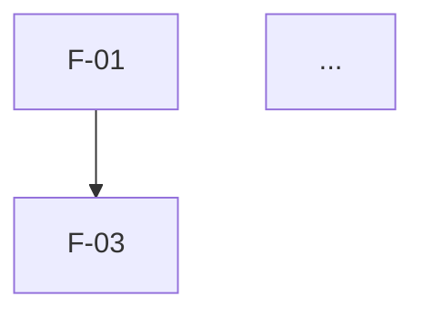

# /agentic-harness:features

Sixth planning stage. Breaks the SRS's requirements into discrete,
buildable features — the unit `/agentic-harness:adr` and
`/agentic-harness:epics` (and eventually `architecture.segments`) work from.
Follows `${CLAUDE_PLUGIN_ROOT}/docs/planning-protocol.md`.

## Gate

`planning.stages.dfd.status` must be `approved`. `design` and `erd` should
each be `approved` or `skipped` (not left `pending`/`draft`) — if either
is genuinely undecided, ask the user to resolve it first
(`/agentic-harness:design`/`/agentic-harness:erd`), since a UI project's
features usually reference screens and a data-bearing project's usually
reference entities.

## Inputs

`planning/SRS.md` (required), `planning/DFD.md` (required — its process
inventory drives the owning-area field below), `planning/DESIGN.md` if it
exists (screen inventory helps group FRs into user-facing features),
`planning/ERD.md` if it exists (entity inventory helps group FRs into
data-facing features).

## Process

0. Follows `planning-protocol.md`'s Document format and Versioning —
   header table with Version/Status, archive-then-write on any rewrite.
1. Group FRs into features — a feature is a discrete, user/system-facing
   capability exercisable end-to-end, not a single FR in isolation and not
   an entire epic-sized area. ("OAuth login via Google," not "auth" and
   not "click login button.") A feature usually stays within one BRD/SRS
   module, but note when it genuinely spans more than one.
2. For each feature, ask/derive:
   - Complexity: S/M/L/XL (rough sizing, not an estimate in hours).
   - MoSCoW priority: Must/Should/Could/Won't (this round).
   - Dependencies on other features.
   - Risk: anything about this feature that's uncertain or technically risky.
   - **Proposed owning area** — the `planning/DFD.md` §3.1 process ID(s)
     (`P#`) that implement this feature's FRs, not a freely invented name.
     Deviate from the DFD only with a stated reason (e.g. a feature spans
     two processes and needs its own name for that reason). This is a
     *candidate* segment for `/agentic-harness:architect` Phase 1.5, not
     binding — architect still surveys real code before finalizing
     segmentation.
3. Build a mermaid dependency graph across features, seeded from
   `planning/DFD.md` §6 Flow Inventory — most real feature dependencies
   are data-flow dependencies (a feature reading D2 can't run before the
   feature that populates it). Confirm with the user rather than
   asserting the derived graph silently.
4. Propose an MVP cut (Must-priority features, respecting dependencies)
   vs. later phases — confirm with the user rather than asserting it.

## Orphan check (bidirectional)

- Every FR should map to at least one feature. An FR with none is reported,
  not silently dropped.
- Every feature should cite at least one FR/NFR. A feature with none is
  reported — either it's serving a requirement that's missing from the
  SRS (go add it) or it's scope creep that needs justifying.
- Every `planning/DFD.md` §3.1 process should be the owning area of at
  least one feature. A process with none is reported — either it's
  serving requirements no feature picked up, or the DFD over-decomposed.
- Every feature's Proposed owning area should resolve to a real DFD
  process ID. A feature that can't be placed in any process is reported —
  that's a signal `planning/DFD.md` needs a version bump (new process),
  not a signal to invent a name.

## Output — `planning/FEATURES.md`

```markdown
# Features

## <Project Name>

| | |
|---|---|
| **Document title** | <Project Name> — Features |
| **Version** | 0.1 (Draft) |
| **Date** | <today> |
| **Based on** | SRS v<x>, DFD v<y> |
| **Status** | For review |

---

## F-01: <name>
- **Description:**
- **User value:**
- **Requirements:** FR-<MODULE>-##, NFR-<MODULE>-## (...)
- **Dependencies:** F-##, ...
- **Complexity:** S/M/L/XL
- **Priority:** Must/Should/Could/Won't
- **Risk:**
- **Open questions:**
- **Proposed owning area:** <DFD process ID(s), e.g. P2 — see DFD §3.1>

(repeat per feature)

## Dependency graph


## MVP cut
### Phase 1 (MVP)
### Later phases

## Orphan check
- FRs with no feature: ...
- Features with no FR/NFR: ...
- DFD processes with no owning feature: ...
- Features with no resolvable DFD process: ...

## Assumptions & Constraints
## Open Items (TBD)
1. <unresolved item> (§<section>)

---
*End of document — Draft v0.1. Open items: <1-line summary, or "none">.*
```

## Approval gate

Per `planning-protocol.md` (Versioning applies — archive before rewrite).
On approval, set `planning.stages.features.status: approved` + `approved_on`.

## Report (≤6 lines)

```
planning/FEATURES.md: v<version> (<written/updated>)
Features: N (MVP: N)
Orphans: FR->feature N, feature->FR N, process->feature N, feature->process N (or "none")
Open items: N
Status: draft/approved
Next: /agentic-harness:adr
```
