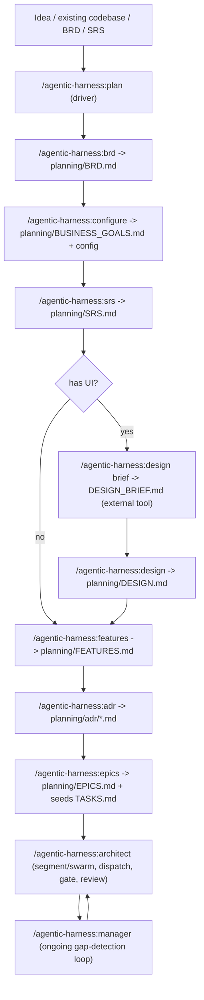

# BRD → Lower-Level Feature Flow

> Reusable across any project using this plugin. This is the planning
> phase — it runs before `/agentic-harness:architect` starts implementation,
> and its own detailed questioning/gating rules live in
> `planning-protocol.md`. This file is the map; the command files
> (`plan.md`, `brd.md`, `srs.md`, `design.md`, `features.md`, `adr.md`,
> `epics.md`) are the implementation.

## Why this exists

Business requirements are not implementation-sized tasks. Standard PM
practice bridges that gap with a decomposition layer — Epics → Features →
User Stories → Acceptance Criteria — before anyone writes code. This
plugin's planning phase implements that layer as six question-driven
commands, orchestrated by `/agentic-harness:plan`, so `TASKS.md` always
starts from a real, traceable backlog instead of an empty file or a
BRD-to-task leap with nothing in between.

## Flow

## Stage-by-stage

| Stage | Command | Artifact | Traces to |
|---|---|---|---|
| BRD | `/agentic-harness:brd` | `planning/BRD.md` (`FR-<MODULE>-##`) | (root) |
| Goals extraction | `/agentic-harness:configure` | `planning/BUSINESS_GOALS.md`, `planning/project.config.yaml` | BRD |
| SRS | `/agentic-harness:srs` | `planning/SRS.md` (same `FR-<MODULE>-##` IDs, elaborated; `NFR-<CATEGORY>-##`) | BRD |
| Design (optional) | `/agentic-harness:design` | `planning/DESIGN_BRIEF.md` then `planning/DESIGN.md` | SRS |
| Features | `/agentic-harness:features` | `planning/FEATURES.md` (F-##) | SRS FR/NFR |
| ADRs | `/agentic-harness:adr` | `planning/adr/ADR-NNNN-*.md` | Features/SRS |
| Epics | `/agentic-harness:epics` | `planning/EPICS.md` (E-##/S-##/T-##), seeds `TASKS.md` | Features → Goals |

Every artifact after the BRD carries a trace back up this chain by ID —
see `planning-protocol.md`'s Traceability section for the exact rule each
stage enforces (orphan checks, the SRS's Appendix A matrix, etc.), and its
Document format / Versioning sections for the header-table + archive
convention every artifact follows.

## Entry points

`/agentic-harness:plan` determines which of these applies on its first run
and records it as `planning.entry_point`:

- **idea** — nothing exists yet; every stage starts from questions.
- **existing-project** — real code already exists;
  `agentic-harness:codebase-analyst` seeds the BRD's feature/actor picture
  and the ADR stage's "Accepted (retroactive)" records, both presented for
  confirmation, never asserted.
- **brd** — a BRD already exists (dropped in `planning/input/` or already
  at `planning/BRD.md`); planning resumes at SRS.
- **srs** — an SRS already exists; planning resumes at design/features.

## Practical steps

1. `/agentic-harness:init` — scaffold `CLAUDE.md`, `TASKS.md`, `planning/`.
2. `/agentic-harness:plan` — drives everything above, asking through edge
   cases at each stage rather than assuming. Stoppable and resumable at any
   stage (`/agentic-harness:plan status`, `/agentic-harness:plan <stage>`).
3. Once `epics` is `approved`, `/agentic-harness:architect` has a real,
   goal-traced backlog to segment the codebase against and start
   dispatching.
4. From there, the normal execution loop takes over:
   `/agentic-harness:manager` → `/agentic-harness:architect` → repeat.

## Status

Implemented — this is no longer a planning-only doc. See `plan.md` and the
six stage command files for the authoritative behavior; this file stays as
the map when onboarding a new project or a new teammate to the flow.
